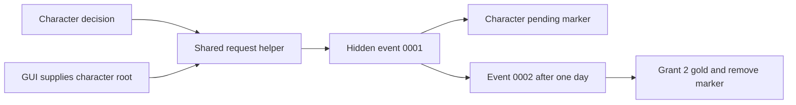

# Annotated examples and acceptance scenarios

These original teaching fixtures illustrate decisions, event chains, interactions, child on actions, parameterized helpers, numeric values and GUI-to-script wiring. **They have not been run in CK3.** Their status is source-informed plus structural verification; no Tiger installation or game launch occurred.

Sources and audit boundary: [native audit](../research/vanilla-audit.md), native decision/event/interaction/on-action `.info` files, current `00_gift.txt`, scripted GUI definitions and callers, parameterized accolade/activity helpers and timed-variable uses.

## Files and flow

| Files | Purpose and contract |
|---|---|
| [Descriptor](mini-mod/descriptor.mod) | Content metadata only; not an external installed-mod registration |
| [Triggers](mini-mod/common/scripted_triggers/doc_demo_triggers.txt) | Character eligibility and parameterized numeric requirement |
| [Effects](mini-mod/common/scripted_effects/doc_demo_effects.txt) | Revalidated chain dispatch and a parameterized gold-creation helper |
| [Values](mini-mod/common/script_values/doc_demo_values.txt) | Reward, payment and pure-arithmetic example |
| [Decision](mini-mod/common/decisions/doc_demo_decisions.txt) | Character decision calling the shared request helper |
| [Events](mini-mod/events/doc_demo_events.txt) | Hidden two-event chain with a one-day delay and expiring pending marker |
| [Interaction](mini-mod/common/character_interactions/doc_demo_interactions.txt) | Player actor transfers 5 gold to a distinct living recipient |
| [On action](mini-mod/common/on_action/doc_demo_on_actions.txt) | Child birthday hook writes a debug message for player characters |
| [Scripted GUI](mini-mod/common/scripted_guis/doc_demo_guis.txt) | Character-root request action using the same eligibility/helper |
| [Localization](mini-mod/localization/english/doc_demo_l_english.yml) | All declared example UI text in English |
| [GUI fragment](gui-fragment.gui) | Explicit insertion fragment outside the mini-mod's loadable directories |

The mini-mod's descriptor advertises a target version for a future test, not a compatibility certification. Nothing here is published, registered or enabled in a playset. A later explicitly requested gameplay test would need an external descriptor pointing at a copied/test content root, a clean playset and appropriate game version.

## Decision and event chain

The decision's root is the evaluating/taking character. Its modern picture block follows the installed developer reference. `is_valid` calls the shared trigger; the effect rechecks it to close the gap between presentation and execution. The seven-day cooldown applies to the decision. The GUI uses the pending-state gate but deliberately has no independent seven-day cooldown; adding identical repeat policy would require shared persistent state.

Event `.0001` saves the requester reference, sets a 30-day owner variable and dispatches `.0002` after one day. The delayed event validates life, pending state and matching requester before granting 2 gold and cleaning the marker. If dispatch fails, the marker expires; the example does not guarantee cleanup on every lifecycle path. Saved-scope propagation across this delay is a stated runtime acceptance check, not an assumed passed test.

Tests: eligible adult player; child/AI exclusion; pending-state exclusion; one delayed reward; two attempts before delivery; save/reload before delivery; invalid/dead receiver; missing saved requester; delayed failure and marker expiry; decision cooldown; fresh startup versus hot reload.

## Interaction and payment

The actor-only availability block excludes AI. Pairwise visibility excludes self and dead recipient; the displayed requirement uses the numeric helper with the fixed payment value. `on_accept` explicitly enters payer scope and repeats the balance/recipient guards before the native-style payment.

This is an immediate automatic-accept teaching transfer, not an imitation of every native gift consequence. It does not add native opinion, struggle catalysts or a native gift-price formula. Confirm the exact player budget treatment in a runtime test. A visible interaction with a later no-op after conditions change also needs user feedback in production.

Tests: balances 4, 5 and 6; actor and recipient identities; exact -5/+5 balances; one transfer only; self-target; dead recipient; diplomatic range; state changes between display and acceptance; two players acting independently; preview and execution agreement.

## Child hook and helper parameters

The birthday example appends a unique child callback instead of replacing a native effect. Its only result is a debug message. Test that existing birthday behaviors still run and that an AI birthday does not emit the player-only message.

Parameterized helpers use literal `$AMOUNT$` substitution. The reward caller supplies a named numeric value, while the affordability helper checks the same fixed payment value used by execution. A real helper interface should state required argument names and permitted numeric reference forms; missing or mistyped arguments are negative validation cases.

## GUI insertion

The GUI fragment is intentionally outside `mini-mod/gui`: copying it unchanged into the mod does not create a complete window. A real GUI task must choose an actual compatible window/template, placement, data context, visibility and tooltip layout after inspecting that window in Vanilla.

All three expressions construct the same character root for `IsShown`, `IsValid` and `Execute`. The action applies to the UI user's player character. A selected-character action must instead supply that selected character. The shared effect revalidates eligibility when clicked.

Tests: render within the actual target widget, enabled/disabled state, missing player context, tooltip text, click target, repeated clicks and unchanged native window content. The structural checker verifies brackets, encoding and references, not GUI rendering.

## Running checks without the game

Use [documentation verification](../tools/verify_documentation.py). It checks internal file links, encoding, CRLF, example syntax structure, cross-file example identifiers, current local evidence hashes and preservation of the originally indexed mod files. It is not a Jomini grammar/type checker.

To search a native comparison, use [lookup](../reference/index-guide.md). To generate complete engine signatures later, use the game's `script_docs`/`dump_data_types` workflow described in [commands](../reference/commands.md).
