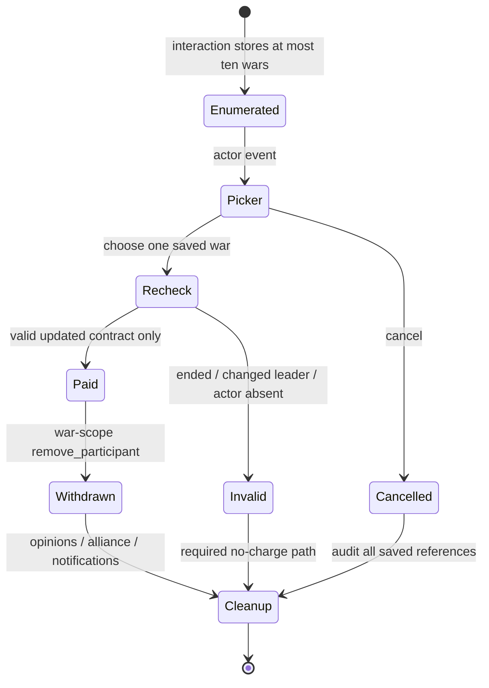
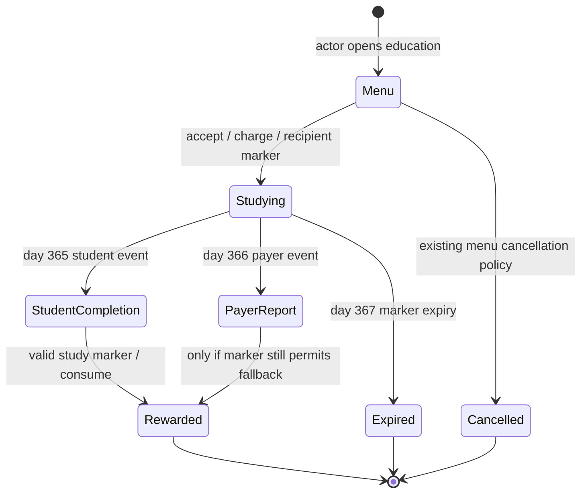

# Workspace function contracts and state ownership

Read the [43 individual contract cards](../update-readiness/contracts/README.md), the [per-mod sheets](../update-readiness/README.md), [conflict matrix](../update-readiness/conflicts.md) and [source register](../update-readiness/sources.md) together. The cards link engine declarations to their exact raw lines and retain the original feature gate. The evidence file records complete rereads of 149 workspace text files and 1,214 native files; this lexical closure is a retrieval surface, not proof that every transitive macro has a resolved semantic contract.

## How to complete a contract

Start at the real decision, interaction, callback or widget, not a helper in isolation. Record its root and named scopes, enumerate each guard and native call, expand every `$PARAMETER$` using the actual caller, then follow each effect and queued event. Read the complete matching `.info`, definitions, callers, localization and assets. Separate the current mod's behavior, its comments/textual intent, and the installed native contract. If an owner, branch, permission or parameter binding remains unresolved, retain that specific gate and its proposed test. A successful export cannot close a lifetime or consent question.

## Conversion requests

Decision root is the requester. The standalone supplies five category/count paths, including tributaries; the bundled copy supplies four. In candidate iteration `this` becomes candidate; entering requester/root changes `prev` at that exact caller to candidate. A shared predicate must retain that contract for both a Script Value count and a send loop. Neither matching counts nor `send_threshold = decline` proves forced acceptance: current native interaction consequences and later responses still need tracing.

Preserve house enumeration rather than silently expanding to a house bloc; preserve the original stronger indirect-vassal protection policy until intent is decided. Native rite, domicile, steppe, promise, diarch and protection gates are relevant. Query/dispatch initialization of `scope:puppet_or_actor` remains unresolved. A missing-scope fallback to actor is now confirmed inside later native conversion effects; it does not establish earlier query initialization. The [source supplement](../update-readiness/mods/mass-demand-conversion-audit.md) records five precise remaining gates and [native tests](../update-readiness/mods/mass-demand-conversion-tests.md). Counts are request candidates at the display snapshot, not delivery or family-conversion totals. The new [contract lab](../examples/contract-lab/README.md) deliberately tests dispatch of an isolated own interaction; success there cannot certify native conversion. Sources: [MC sheet](../update-readiness/mods/mass-demand-conversion.md) and MC-CANDIDATES/MC-DISPATCH cards.

## War withdrawal

The interaction actor is a secondary participant; recipient is leader. The current script stores up to ten war references and opens a selector. Each branch must revalidate current war existence, same side, actor membership and non-primary status before any price or removal. Saved war references are event-chain state, not a durable character preference.

This diagram distinguishes the intended safe update from currently unproven revalidation/cleanup paths. Base policy is 25 × tier gold and 50 × tier prestige, with six rule variants; “nothing” still attempts alliance breaking in existing code. `add_prestige` plus explicit experience subtraction needs live delta comparison before refactoring. Native removal callbacks and custom messages can overlap. Sources and exact table: [LW sheet](../update-readiness/mods/leave-wars.md).

## Additional education and delayed state

The payer is interaction actor; the student is recipient, and self-study intentionally combines those roles. The selected ordinary discipline costs five times recipient skill in both gold and prestige; prowess uses four times prowess. Initial stress is payer +10, student +35. Six discipline branches apply temporary study modifiers. The student owns the study marker; a saved actor/recipient reference is not a guarantee that its object remains alive or player-controlled.

The two completion paths attempt to retain reward after payer death. They are not a proven duplicate-reward bug. Verify exactly once across self-study, separate students, payer/student death, changed court, reload at days 364–367 and stale events from an earlier course. Permanent reward, expiring marker and chain-local references have different owners/lifetimes. A generation token would be a design change requiring a fully audited chain contract, not a guessed cure. Source: [SI education section](../update-readiness/mods/serp-interactions-decisions.md).

## Payments, hooks and religion

Money transfers execute in actor scope with recipient as target. Preserve 50/100/250/500 values, including the deliberate 250-gold AI-recipient exception. Display-time affordability is insufficient for a mutable target; audit execution guards and short-term budget accounting. The teaching fixture tests a fixed five-gold transfer but does not certify these original interactions.

The pardon calls `use_hook`, so the export's weak removal/strong cooldown distinction resolves the primitive description only. Choosing permanent deletion for strong hooks requires an explicit intent decision before updating the mod. Keep that question in the [decision register](../update-readiness/behavior-decisions.md).

Excommunication helper substitution must bind all of `EXCOMMUNICATOR`, `REQUESTING_CHARACTER`, `TARGET_CHARACTER`; direct powers and requested powers assign different roles. The replacement crime helper accepts `RITE`, `TRAIT`, `GENDER_CHARACTER`, not the old `FAITH` argument. Audit the actor/authority/victim redirect and whose rite governs each crime in both eligibility and price. Do not choose a rite merely from a helper name. Current clergy, territorial authority, protection, legitimacy and response consequences are relevant to the existing temporal-authority feature. Sources: SI-EXCOMM and the SI sheet's exact formula/role table.

## Notification callbacks and GUI

Each callback supplies its own root/guaranteed/optional targets. War start, secondary joining, death and court departure cannot share a guessed context. Recipient collections must document owner, membership overlap, deduplication policy and lifetime. Missing killer/employer/spouse must be guarded before portrait or text resolution. A message sent inside one character scope should be compared to per-player delivery, with native notifications counted separately. Sources: [SerpAlerts sheet](../update-readiness/mods/serp-alerts.md), on-action/message `.info` and exported callback declarations.

GUI observation and execution are distinct. All three ScriptedGui calls must use the same constructed root; a player action uses player root, a selected-character action uses the selected object. `open_view_data` without a player is a routing question in multiplayer. Current two-argument ruler-designer calls do not establish that old calls lack an overload, or that the engine permits post-start editing. Full replacement GUI paths must retain the entire current native content, not merely the old changed button. Sources: CD-RULES/CD-LOBBY/CD-TOOLTIPS and SA-EDUCATION cards.

## Graphics and variants

An asset basename or existing mod comment is not proof of a live consumer. Trace current widget/asset path, atlas dimensions, `framesize`, frame expression and container header. Native portrait rank is 1374×194 with 196×194 frames, while the old rank texture is 1176×194; a raw seven-frame comparison is prepared without inventing tier labels. PNG bytes under `.dds` remain an engine-acceptance test, not permission to silently convert original art. [Private GUI/frame fixture](../examples/gui-frame-lab/README.md) and [asset manifest](../examples/fixture-assets.json) preserve source hashes.

Standalone/bundle conversion and withdrawal share IDs and are alternatives. Public/local graphics packages share paths and represent alternate selections. Knight variants/test also share native trigger/window identities; they are learning material only, excluded from updating. See [Knight contracts](knight-manager-contracts.md). DLC gates follow each actual native/helper branch; a filename does not establish a blanket dependency.

## Subsequent standalone MDC static migration review — 2026-10-03

The [new review and exact evidence](../update-readiness/mods/mass-demand-conversion-static-migration.md) statically verify the five category routes, requester root/candidate prev in queries, requester root/candidate this in dispatch and selected existing guards. Scope.ScriptValue and fixed-option GUI exports remain available, and the widget is byte-identical between pinned versions. The common native helper now converts to rites; MDC has no copied old faith-conversion implementation to replace. No required functional 1.20 patch is demonstrated. Engine construction/options/validation and native lifecycle/list/MP behavior remain explicit boundaries; this does not certify a complete feature audit or runtime compatibility.
